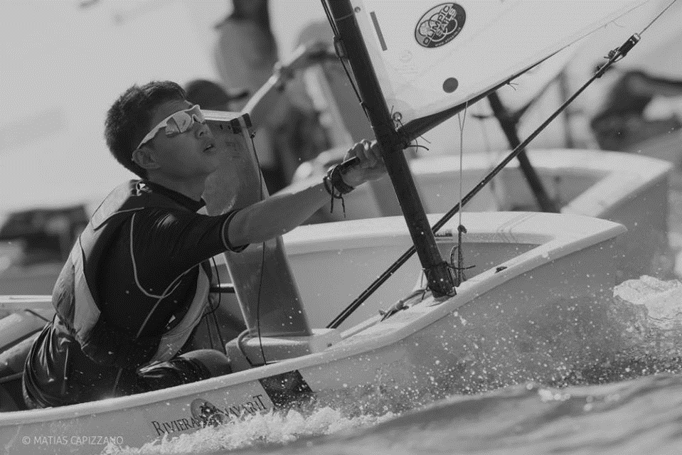

# Sailing Sportsboy / Sportsgirl Meritorious Awards

[< Back to Home](../README.md)

I’ve had the honour of being a part of the Optimist National Team from 2010 to 2014 where I represented Singapore in various international competitions. I was awarded the [Sportsboy/ Sportsgirl Meritorious Award](https://www.singaporeolympics.com/singapore-sports-awards/) by the Singapore National Olympic Council for the following events.

## IODA Optimist Asians Championship 2014

* June 2014
* Individual: 7th
* Team: 2nd

## IODA Optimist North American Championship 2014

* July 2014
* Individual: 4th
* Team: 1st

## IODA Optimist Worlds Championship 2014

* October 2014
* Individual: 72nd
* Team: 2nd
