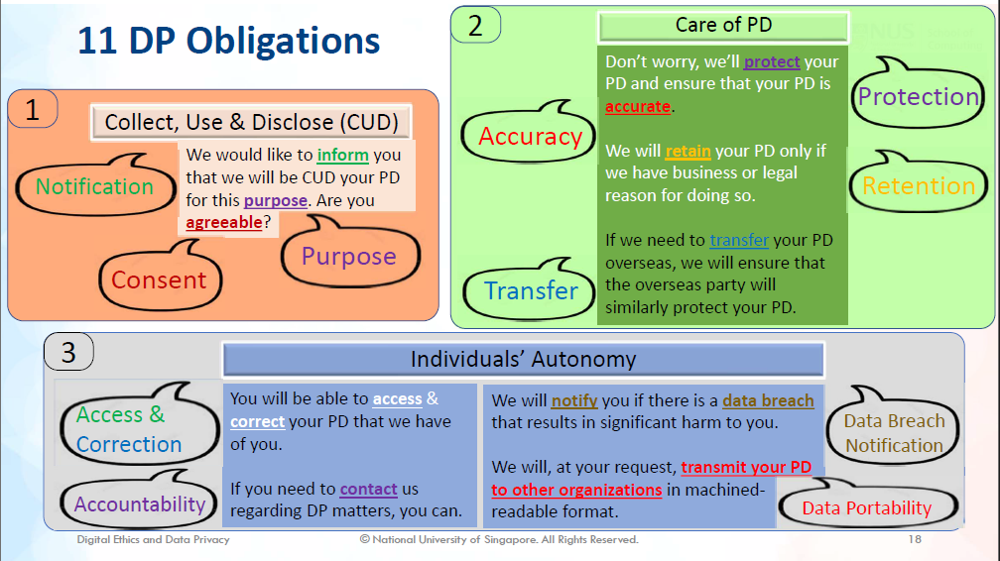

# A Critical Lens into Data Privacy: NUS InfoSec Curriculum

[< Back to University Essays and Work](/uni_work/uni_work.md)

## Introduction

Data breaches in Singapore have been on the rise ever since 2005, affecting millions of individuals’ records (CSA, 2022). However, Singapore still faces a data privacy crisis with sensitive data exposure affecting 57% of private organisations (Yu, 2022) and increasing data incidents in the public sector (Chia, 2023). In fact, it is predicted that this situation will only worsen as Singapore continues its digitalisation efforts (Straits Interactive, 2023). Naturally, Singaporeans are concerned about data privacy issues arising from cyber-attacks (Zulhusni, 2022).

Hence, to contribute to Singapore’s need for cybersecurity talent (NUS, 2018, p. 1), the National University of Singapore (NUS) introduced the Information Security (InfoSec) degree in 2015 which enhanced the information security specialisation in the Computer Science degree (Chang, 2021, p. 5). Promotional materials explain that the programme helps students understand social aspects of security on top of the technical knowledge, which develops skills students can use to “improve the world in this regard” (NUS Computing, n.d.).

However, critical cybersecurity academics have increasingly recognised that many purported solutions to cybersecurity threats often exclude or negatively affect less-empowered communities (Redmiles, Bennett, & Kohno, 2023, p. 49). This use of critical theory in data privacy reveals power dynamics between the protectors and the protected, in order to question if data privacy solutions truly bring individuals data privacy (Dwyer, et al., 2022, p. 12). As a student of NUS’ InfoSec program, which claims to prepare students to improve the world, I am therefore compelled to ask: to what extent has NUS developed critical InfoSec students, with respect to data privacy?

To investigate this, I analyse three NUS InfoSec modules through a critical lens to show, firstly, how data privacy is portrayed, and secondly, the methods suggested for students to achieve data privacy. I argue that NUS assumes that data privacy is a human right, and that the protection of data safeguards the individual’s privacy. Further, I discover that these assumptions result in mechanisms that disempower individuals and their privacy. Hence, I recommend several guiding questions for NUS that may prompt students to adopt a critical lens.

## Methodology

To support my thesis with evidential texts, I analyse the lecture and tutorial materials from three modules that underscore NUS InfoSec’s approach to data privacy. The first is IS1108 Digital Ethics and Data Privacy, which is a compulsory first-year module for all computing students. It aims to give students a strong professional basis before embarking on their specialisations, with emphasis on ethical principles and how it should govern technology. The next is CS3235 Computer Security, which is a compulsory module for InfoSec students and Computer Science students specialising in cybersecurity. It is the only technical module selected and hence delivers the technical knowledge to understand different types of cybersecurity attacks, as well as their defences. Lastly, IS4231 Information Security Management is a sub-specialisation elective module for students interested in the managerial, instead of technical, aspects of information security. It covers security laws, policies, and regulations that help to govern cybersecurity in an organisation, including those related to data privacy.

I also draw on a framework by Stahl et al. to guide my analysis using critical theory. Stahl identified four critical topics, shown in Figure 1, that were used to analyse information security policies of hospitals in the United Kingdom (Stahl, Doherty, Shaw, & Janicke, 2013, p. 681). In doing so, they identified power relations affecting patients and their data to highlight issues in the data privacy of electrical medical records.

*Figure 1: Stahl's et al. description of critical concepts (Stahl, Doherty, Shaw, & Janicke, 2013)*

Likewise, I borrow these concepts to analyse module materials, so as to uncover issues relating to how NUS addresses data privacy. Hence, for each module, I will explore the following concepts and questions:

* Power: Who determines what data privacy is? How should it be attained?
* Ownership: To whom does data belong to and why?
* Legitimacy: What are we defending against? Why should we defend against it?
* Emancipation: What is the ideal outcome that is striven towards? How does the individual factor in this outcome?

## IS1108 Digital Ethics and Data Privacy

IS1108 focuses on digital ethics and therefore views data privacy as the moral good, supported by how it interprets personal data as owned by individuals. However, IS1108 also implies that the Singapore’s Personal Data Protection Act (PDPA) achieves that goal, hence legitimising the power of the Singapore state.

With “data privacy” in its title, IS1108 clearly frames data privacy as an ethical good that is the ideal outcome to pursue. For example, a slide from the introductory lecture shows that data privacy is an ethical guidelines for a professional, distinct from other concepts like data security and protection (Figure 2).

*Figure 2: IS1108 Lecture 1 showing a data privacy as an ethical guideline (Lee, 2023, p. 6)*

When summarising the organisation’s obligations under the PDPA, IS1108 also references personal data (PD) with the “individual” or “your”, as shown in Figure 3. This puts the organisation as an entity that performs a service for the individual, to whom the data belongs. The resultant hierarchy implicitly places the individual on top and above the organisations. Given the ethical basis that IS1108 starts from, this further supports the idea that data privacy is the endorsed outcome where the individual has power over how organisations manage their data.

*Figure 3: IS1108 Lecture 6 describing the 11 data protection obligations (Loh, 2023, p. 18)*

However, IS1108’s advocation for the PDPA as the solution towards this ideal outcome endorses the power in the state instead of the individual. For instance, the only lecture covering data related ethics focused entirely on the PDPA, explaining how students should understand terms like “personal data”, “individuals”, and “organisations” as defined by the PDPA (Figure 4). It is here where we can observe that the power is with the Singapore state who introduced the PDPA and enforces it through the Personal Data Protection Committee (PDPC, 2023). It is through them that definitions of what data privacy is, and therefore how organisations must act, are set.

*Figure 4: IS1108 Lecture 6 showing definitions of "individuals" and "organisations" (Loh, 2023, p. 7)*

## CS3235 Computer Security

The persona of an “attacker” is most clearly mentioned in CS3235, which is defined by the amount of information they can learn about the individual. From this, the ideal outcome is suggested to be “differential privacy”. However, despite the name, it is noted that it is distinct from privacy.

As a technical module, CS3235 gives the most direct indication to what we are protecting against referred to only as “the attacker” or “adversary”. The formulation of the “attacker” identity consists of identifying what they can and cannot do, as well as what they can possibly do if actions were not taken. For example, the lecture provides security interpretations of anonymisation are defined by what the attacker would be unable to do given a dataset (Figure 5). Specifically, the capabilities are framed as “what and how much they can know about the individual”.

*Figure 5: CS3235 Part 3 showing definitions based on the attacker’s capability (Shokri, 2021, p. 12)*

Additionally, CS3235 offers a more technical account of “differential privacy” as the ideal outcome, where new information about an individual cannot be learnt from their participation in the database (Figure 6). Essentially, differential privacy recognises that an adversary can still identify an individual with aid from external databases out of the organisation’s control. Hence, it employs probability to ensure that even with all possible external databases, new information cannot be attributed to individuals.

*Figure 6: CS3235 Part 3 describing differential privacy (Shokri, 2021, p. 31)*

However, it should be noted that the individual does not play an active role in “differential privacy”. Privacy is internationally defined as “the right of a human individual to control the distribution of information about themselves” ((ISC)2, 2021, p. 586). Hence, “differential privacy” employs a sort of data protection where the organisation obfuscates an individual’s data, which is distinct from the “ability to control” where the individual can “control the distribution” of their data.

## IS4231 Information Security Management

IS4231 recognises the role that legislation plays in creating a moral outcome, but, in its explanation of the PDPA, reveals how the PDPA seeks data protection, not privacy. By advocating for the PDPA, it solidifies power held not only by the state, but also by organisations over individuals, which is exacerbated by how IS4231 describes data as owned by organisations. Although the PDPA requires individuals to give consent, it is noted that this does not imply autonomy and, by extension, privacy.

Given that IS4231 is a management module concerned about legislative compliance, it uses compliance to justify protection. It describes information security law, such as the PDPA, as a form of financial deterrence. However, although this suggests a utilitarian cost-saving justification, it is ultimately recognised that the purpose of law is to deter against unethical practices. Furthermore, the ACM Code of Ethics is quoted in lectures, of which “respect privacy” is an ethical principles (Figure 7). Hence, privacy is portrayed as a deontological moral good, where computing professionals have a moral duty to protect individuals’ privacy.

*Figure 7: IS4231 Lecture 2 showing "Respect privacy" as an ethical principle (Yang, IS4231 L2 Compliance: Law and Ethics, 2023, p. 3)*

Despite being grounded in ethics, IS4231’s ideal outcome is more practical. The lecture highlights the purpose of the PDPA, which “recognises both the right of individuals to protect their personal data and the need of organisations to collect, use or disclose personal data for purposes that a reasonable person would consider appropriate in the circumstances” (Figure 8). Notably, the use of “right… to protect their personal data”, instead of “right to privacy”, indicates a different outcome that is distinct from the moral conception of data privacy. IS4231 focuses on the actions and responsibilities of the organisation, with the end goal as reasonable protection of individuals’ data. Although ethics is recognised as the ulterior goal of compliance, it is assumed that data protection results in privacy.

*Figure 8: IS4231 Lecture 2 describing the goals of the PDPA (Yang, IS4231 L2 Compliance: Law and Ethics, 2023, p. 16)*

Regardless, this obligation to obey legislation cements the power of the state. IS4231 highlights the penalties for non-compliance (Figure 9), which demonstrates how the state enforces compliance, independent of any ethical or moral basis. Through punishment, the state is able to control the data privacy narrative in Singapore.

*Figure 9: IS4231 Lecture 2 highlighting the financial penalties of non-compliance (Yang, IS4231 L2 Compliance: Law and Ethics, 2023, p. 23)*

However, a subtler yet significant power relation is also present between the organisation and the user. IS4231 highlights the PDPA repeated use of the word “reasonable” to describe the required actions of the organisation. For example, organisations are obligated to make “reasonable security arrangements” or remove personal data “as soon as it is reasonable to assume that” it is no longer required for its original purpose (Figure 10). Since these prescriptions are intentionally vague, this give organisations liberty to implement “reasonable” controls as they seem fit, regardless of the individual’s preferences. However, this appears to give autonomy to the organisation instead of the user, developing a power structure where the individual is subject to the organisation.

*Figure 10: IS4231 Lecture 2 showing the use of the word "reasonable" in the PDPA (Yang, IS4231 L2 Compliance: Law and Ethics, 2023, p. 17)*

In fact, this power structure is enforced with how IS4231 presents the ownership of data. Tutorial 6 explains the different responsibilities relating to data, one of which is the data owner (Yang, Tutorial 6: NUS InfoSec Program, 2023, p. 3). Using the NUS Data Management Policy as the case study, students are taught that the data owner is NUS (Figure 11). In fact, all the data responsibilities listed in the tutorial are NUS staff, with the individual or “data subject” notably missing. This implies a hierarchy where organisations own data about the users, and the users appear not to have any control or rights over it.

*Figure 11: Screenshot from the NUS Data Management Policy (NUS, 2020, p. 5)*

Although neither the tutorial nor the NUS Data Management Policy gives an explicit justification for appointing organisations as data owners, international textbooks informs that “the data owner is accountable for determining the value of the data that they own and, therefore, also for the protection of the data” ((ISC)2, 2021, p. 90). In such a case, it appears that this attribution of responsibility is a result of the need for accountability and compliance, such that organisations will be required to invest in data protection for the users’ benefit.

It is observed that individuals are also referred to with respect to their consent in the PDPA, where the “Consent Obligation” allows organisations to collect, use, or disclose personal data only for purposes that an individual gave consent to (Figure 12). However, it is debated that consent does not imply autonomy (Milligan & Jones, 2016) with critics in the biomedical sphere arguing that consent is unnecessary and insufficient for protecting individual autonomy (Pugh, 2020). With privacy requiring individuals to maintain control, it can be argued that consent is insufficient to provide individuals with the true ability to control their data, if only “all-or-nothing” options are provided.

Figure 12: Infographic showing the Data Protection Obligations under the PDPA (PDPC, 2023)

## Discussion and Conclusion

The critical analyses yielded several findings. First, NUS promotes data privacy as an ethical good that computing professionals to aspire towards. As such, methods like “differential privacy” and the PDPA are endorsed by NUS as justified means to attain this goal. Next, these methods unfortunately portrays organisations as the owners of individuals’ data, and therefore transfers the responsibility to protect them. However, this ultimately supports power relations with the Singaporean state and organisations on the top, and individuals below. Lastly, by endorsing these methods, it appears that individuals’ right to privacy is not effectively protected.

Hence, I argue that NUS have not sufficiently developed critical InfoSec students because it does not educate students to question two key assumptions that are made. NUS assumes that, firstly, data privacy is a human right and, secondly, that the protection of data (as in differential privacy and the PDPA) implies the protection the individual’s privacy. This results in a focus on technical measures, compliance, and cybersecurity management as the solution, which in turn shifts data ownership, and subsequently the control of their data, away from the individual. This reinforces the power relations of the state over organisations, and organisations over the individual.

However, this removes autonomy and power of the individual to control their own privacy, worsening the power imbalance for individuals. 4 years after the introduction of the PDPA in 2012, KPMG found that Singaporeans felt the most defenceless among other Asian demographics in how organisations handle their data (KPMG, 2016). More recently in 2020, OpenText found that an overwhelming 72% of Singaporeans are unaware of how organisations are using, storing, or accessing their data, resulting in a severe 71% distrust in the data protection capabilities of organisations (OpenText, 2020). In fact, it has been recognised that the PDPA was simply not designed for data privacy (Ng, 2021). Regardless, Singaporeans still feel disempowered regarding data privacy, and steps should be taken to alleviate this problem.

Therefore, to develop more critical InfoSec students, students should be pushed to question the strong assumptions that were made and taught by NUS. Several critical guiding questions are as follows:

* What is data privacy?
* Why should we strive for data privacy?
* What are the goals of our established solutions and how do they allow us to attain data privacy?
* Which stakeholders are less empowered as a result of these solutions? Should we empower them and if so, how?

Ultimately, given that individuals are less empowered in the current technological world, perhaps critical students may place the powerless individuals in the centre when developing new ideas and solutions that return the power over their data back to the individuals. By revealing inherent power dynamics in data privacy, this could eventually fulfil critical theory’s goal of a more just and equitable society (Redmiles, Bennett, & Kohno, 2023, p. 48).

---

## References

(ISC)2. (2021). CISSP Official (ISC)2 Student Guide (6th ed., Vol. 1). (ISC)2.
Chang, E.-C. (2021). Briefing Bachelor of Computing in Information Security 2021/22. Retrieved from NUS Computing: https://www.comp.nus.edu.sg/images/2021_InfoSecFreshmenBriefing.pdf
Chia, O. (31 July, 2023). Data incidents in Singapore’s public sector on the rise, 182 recorded in 2022. Retrieved from The Straits Times: https://www.straitstimes.com/tech/data-incidents-in-singapore-s-public-sector-on-the-rise-182-recorded-in-2022
CSA. (28 November, 2022). Cyber Security Agency of Singapore. Retrieved from Data Breaches: https://www.csa.gov.sg/Tips-Resource/publications/cybersense/2022/data-breaches
Dwyer, A. C., Stevens, C., Muller, L. P., Cavelty, M. D., Coles-Kemp, L., & Thornton, P. (22 July, 2022). What Can a Critical Cybersecurity Do? International Political Sociology, 16(3), 1-26. doi:https://doi.org/10.1093/ips/olac013
Hurel, L. M. (24 August, 2022). Interrogating the Cybersecurity Development Agenda: A Critical Reflection. The International Spectator, 57(3), 66-84. doi:https://doi.org/10.1080/03932729.2022.2095824
KPMG. (7 November, 2016). Companies that fail to see privacy as a business priority risk crossing the ‘creepy line’. Retrieved from KPMG: https://kpmg.com/sg/en/home/media/press-releases/2016/11/companies-that-fail-to-see-privacy-as-a-business-priority-risk-crossing-the-creepy-line.html
Lee, B. (2023). Digital Ethics and Data Privacy Module 1: Professional Ethics. Singapore, Singapore, Singapore.
Loh, Y. (2023). Relevance of Data Protection to Infocomm Technology (ICT). Singapore, Singapore, Singapore.
Milligan, E., & Jones, J. (2016). Rethinking Autonomy and Consent in Healthcare Ethics. In P. A. Clark, Bioethics - Medical, Ethical and Legal Perspectives. doi:10.5772/62798
Ng, J. (17 January, 2021). The Big Read: What’s the big deal with data privacy? Thorny, complex issues confront citizens and govts. Retrieved from Today Online: https://www.todayonline.com/big-read/big-read-whats-big-deal-data-privacy-thorny-complex-issues-confront-citizens-and
16
NUS. (2018). New degree programmes presenting the inaugural batch of graduates at NUS Commencement 2018. Retrieved from National University of Singapore: https://www.nus.edu.sg/newshub/pressrel/2018/2018-07/C2018%20-%20New%20degree%20prog%20with%20first%20cohorts-annex%20A.pdf
NUS. (2020). NUS DATA MANAGEMENT POLICY. Singapore.
NUS Computing. (n.d.). Bachelor of Computing in Information Security (with Honours*). Retrieved from NUS Computing: https://www.comp.nus.edu.sg/programmes/ug/isc/
OpenText. (21 August, 2020). Data privacy and trust in a digital-first COVID-19 era – findings by geography. Retrieved from OpenText: https://blogs.opentext.com/data-privacy-and-trust-in-a-digital-first-covid-19-era-findings-by-geography/
PDPC. (30 June, 2023). About Us. Retrieved from Personal Data Protection Committee: https://www.pdpc.gov.sg/Who-We-Are/About-Us
PDPC. (19 April, 2023). Data Protection Obligations. Retrieved from Personal Data Protection Commission Singapore: https://www.pdpc.gov.sg/overview-of-pdpa/the-legislation/personal-data-protection-act/data-protection-obligations
Pugh, J. (2020). Autonomy, Rationality, and Contemporary Bioethics [Internet]. Oxford: Oxford University Press. doi:https://doi.org/10.1093/oso/9780198858584.001.0001
Redmiles, E. M., Bennett, M. M., & Kohno, T. (14 April, 2023). Power in Computer Security and Privacy: A Critical Lens. IEEE Security & Privacy, 21(2), 48-52. doi:https://doi.org/10.1109/MSEC.2023.3238591
Reventlow, N. J. (23 October, 2020). Digital Freedom Fund. Retrieved from Decolonising Digital Rights: Why It Matters and Where Do We Start?: https://digitalfreedomfund.org/decolonising-digital-rights-why-it-matters-and-where-do-we-start/
Shokri, R. (2021). Computer Security: Information Security - Data Privacy. Singapore, Singapore, Singapore.
Stahl, B. C., Doherty, N. F., Shaw, M. C., & Janicke, H. (30 November, 2013). Critical Theory as an Approach to the Ethics of Information Security. Science and Engineering Ethics, 20, 675–699. doi:http://dx.doi.org/10.1007/s11948-013-9496-6
17
Straits Interactive. (28 February, 2023). Data Protection Predictions for 2023. Retrieved from SMU Academy: https://academy.smu.edu.sg/insights/data-protection-predictions-2023-8831
Yang, L. (2023). IS4231 L2 Compliance: Law and Ethics. Singapore, Singapore, Singapore.
Yang, L. (2023). Tutorial 6: NUS InfoSec Program. Singapore, Singapore, Singapore.
Yu, E. (17 May, 2022). Singapore firms see high rate of security incidents, but struggle to respond promptly. Retrieved from ZDNet: https://www.zdnet.com/article/singapore-firms-see-high-rate-of-security-incidents-but-struggle-to-respond-promptly/
Zulhusni, M. (28 November, 2022). Data protection is vital: 85% of Singaporeans concerned about how companies use their data. Retrieved from Techwire Asia: https://techwireasia.com/2022/11/data-protection-is-vital-85-of-singaporeans-concerned-about-how-companies-use-their-data

[< Back to University Essays and Work](/uni_work/uni_work.md)
