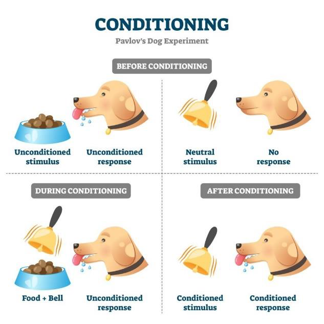

# Defending Anti-Realism with Empirical Evidence

[< Back to University Essays and Work](/uni_work/uni_work.md)

## Introduction

In “A Darwinian Dilemma for Realist Theories of Value”, Sharon Street casts doubt on moral realism by asserting the Darwinian Dilemma. She first establishes how moral realism posits objective independent evaluative truths that provide normative reason to carry out certain actions and are independent of what Street calls evaluative attitudes. These attitudes are states such as desires or attitudes that hold evaluative judgement.

Street then asserts that evolution explains how humans came to hold certain evaluative beliefs that favour our evolutionary survival. It should also be noted that both biological and sociological explanations cohere with Street’s arguments, since both directly factor into why we hold certain judgements. Thus, the crux of Street’s Darwinian Dilemma is “what is the relationship between evolutionary explanations for our evaluative judgements and the independent evaluative truths that realism posits?” On one hand, denying this relation indicates that both evolution and our moral beliefs are false. On the other hand, asserting the relation would suggest that evolution is a simpler explanation to our evaluative attitudes, rendering moral truths unnecessary. This sets up the dilemma, suggesting that an antirealist conception of morality is more likely than moral realism.

The pain objection was one of the three objections addressed by Street, arguing that the badness of pain is an independent objective truth about moral value. In fact, the realist asserts that the badness of pain would easily explain how we are evolutionarily able to “track” and evaluate pain. Street subsequently counters that pain should be understood as a sensation that unreflectively compels a being to avoid it. Rejecting this definition is implausible since the realist cannot account for the coincidence that evolutionary theories also give a simpler explanation of how we come to understand that pain is bad. However, accepting the definition concedes that pain’s badness is dependent on evaluative attitudes to recognise pain as bad. Hence, realists still face the dilemma.

However, Street’s account relies heavily on the “simplicity” of evolutionary explanations, which subsequently sets up the dilemmas. While this may pose an issue for realists, it is not a definitive disproof of moral realism. For instance, it is possible for realists to develop a simpler definition of pain that enforced the pain objection.

Instead, I counter the pain objection from an empirical basis, drawing on both scientific and sociological evidence. I achieve this by confronting the “pleasure objection”, a variant of the pain objection, which asserts the goodness of pleasure. By showing the science behind pleasure, I establish that pleasure exists as a means to support certain behaviours. Following that, I establish two interpretations of pleasure as moral good, firstly, as a means to identify goodness in actions, and secondly, as a moral good in itself. However, I will show that both positions are infeasible for the realist, hence defending against the pleasure (and pain) objections from an empirical perspective.

## Empirical Evidence

Discoveries in scientific investigations of pleasure shows that the feeling of pleasure is triggered by a set of hormones that are released in our bodies. The hormones serotonin, dopamine, and oxytocin are most associated with pleasure, with each described to be responsible for satisfaction, love, and intimacy respectively. Neuroscientists also discovered several other neurochemicals that are involved making someone feel good. These include endocannabinoids, endorphins, GABA, and adrenaline. This first shows that pleasure is grounded in, and controlled by, physical elements.

Another scientific theory relevant to this discussion is conditioning. The first breakthrough in this field was made by Ivan Pavlov who, during an experiment on dogs, noticed that the dogs salivated when food was placed in front of them. However, over time, the dogs started to salivate even before the food arrived, and upon hearing the food cart. This is called classical conditioning, where a physical response can be automatically invoked to a conditioned stimulus, as shown below.

Operant conditioning is a variant of classical conditioning where behaviours that are rewarded tend to be repeated, which behaviours that are punished tend to be reduced. This is also commonly understood as positive and negative reinforcements, where a subject seeks to repeat certain behaviours to enjoy pleasure in positive reinforcements and stop other behaviours to avoid displeasure in negative reinforcements.

Considering all the scientific theories raised, we see how evolutionary theories suggest that pleasure is used as means to promote certain behaviours that support survival. At the infancy of the human species where humans are most similar to animals, primitive and basic pleasures exist to promote actions that boost survival, which eventually becomes encoded into our genes. For example, humans who are able to produce pleasure hormones as a result of eating, drinking, and reproducing are more likely to survive than those who are not.

As the environment evolved into modern times, social environments played an increasingly larger role in one’s survival compared to physical ones. This is where both classical and operant conditioning use pleasure and pain to promote behaviours for survival. Back when disloyalty to the ruling family could mean death and loyalty is often rewarded, humans in general associated patriotic loyalty with pleasure. Especially when patriotism is often celebrated in the current world, such positive feelings are used to promote certain behaviours that benefit an individual’s own country.

Therefore, what is consistent across these theories is that pleasure is used as a means towards an end of a behaviour that is desired. Evolution provides the explanation that desirable behaviours are often those that lead to survival.

## The Realist Position

With the scientific evidence established, this begs the question: where does the moral realist’s conception of moral value lie? There are two options for the realist, assuming that the realist asserts that pleasure is somehow involved in moral value. The first is that pleasure retains its evolutionary purpose as a reliable means towards discovering moral properties in actions that it promotes. The second is asserting that pleasure itself, as an evolutionary means to an end, contains moral value.

## Pleasure as a Means

The realist can posit that pleasure successfully tracks moral elements in actions, like how non-naturalists believe that moral properties are not reducible to non-moral properties. Instead, goodness exists as a property on its own, and can be perceived and identified by us. For example, they assert that the action of helping someone in need itself has the property of goodness, and hence, we are able to feel pleasure when executing that action.

However, because of its coherence with empirical evidence, the realist have to account to its implications. The traditional understanding of evolutionary theories explain how living beings react and evolve within their physical environments, accounting for variations between different species, despite originating from the same being. The emphasis of physical environments unfortunately neglects social environments, which account for differences among communities. Given different social environments, different communities are conditioned to feel pleasure towards different actions that help them thrive in those environments. For example, people in some countries may find pleasure in asserting physical dominance and patriotic loyalty by engaging in war, while others feel the same pleasure in the restraint and rejection of the same physical might and loyalty. In fact, many other moral disagreements found across cultures can be accounted for by social evolution.

If a realist were to assert that pleasure reliably perceives non-natural moral goodness, then they cannot account for the fact that different communities have the same pleasure responses to different actions. By attributing pleasure to evolutionary considerations, we effectively relate pleasure to the environment which it evolved. However, this contradicts any realist conception of morality. Its dependence on environment necessarily involves a sense of subjectivity in morality, where it is possible for an action X and not X to both be morally good. Yet, subjectivity is unacceptable in realism, since realism asserts that morality is an objective and universal truth.

It is possible that the realist would assert that many modern beliefs are incorrectly formed because they were formed by conditioning which is a “manipulated” version of pleasure, since there is social interference which intentionally misleads and distorts how we perceive goodness. However, such a position is infeasible and leads to an infinite regress. While social environments play a part in sculpting pleasure experiences, we have to acknowledge that further into our ancestral history, physical environments do too. Since there are no relevant differences between physical and social environments in how they shape our behaviour for survival, realists are then forced to also assert that that physical environments also distort the perception of goodness. This leads to a continuous questioning which leaves the realist unable to explain what exactly the “true” pleasure perception of goodness is.

## Pleasure as an End

The alternate option for the realist is to assert that moral value lies in pleasure itself. This position branches off consequentialism which maintains that the morality of an action is dependent on its outcome. More specifically, this a hedonistic view where we aim to increase the overall pleasure in the outcome of an action. Often, this also extends to include reducing the overall pain of an action. Having pleasure embody moral properties is often attractive to realists due to our biological attraction to pleasure as being “good” and therefore leading us to do “good” actions.

Hedonism places pleasure as an end in itself, where the consequentialist enquiry ends. Any actions or behaviours that are acted upon are judged by how much pleasure they produce, which presents a clear cause and effect relationship, having an action cause and create certain amounts of pleasure, which eventually determines the “goodness” of an action.

However, it fundamentally is inconsistent with our empirical evidence. The evidence previously presented presents pleasure as a means to an end of survival. Pleasure exists as an evolutionary mechanism that promotes any actions that happen to best benefit our continuation in the physical and social environment that we are in. Given millions of years of varying environments, pleasure acts more similarly to a tool or method that is unbiasedly used to condition humans (and other animals) to perform an arbitrary action.

This inconsistency can be better shown by drawing a comparison to another evolutionary feeling: hunger. We often feel hungry when we have no consumed sufficient food, and intuitively take hunger as an indication that we would need to eat. Just like pleasure, the feeling of hunger serves as a mechanism and method to get humans to eat. After all, if a being is unable to feel hungry and therefore does not consume food, it is quite obvious why this would not be beneficial for them. As our society evolves, we have also become conditioned to feel hunger to new items, such as instant noodles, coffee, or raw salmon, all of which were not common food items in the past. Yet, hunger itself is not an end in itself, but rather a means towards the goal of sustenance. It would therefore be inconsistent and awfully strange to assign hunger with a value property in itself.

Even if the realist insists that the means hold the moral value, the implications are still unacceptable for realism. Given the role that pleasure plays, no other objective moral judgements can be made since the actions that one can feel pleasure towards are arbitrary and dependent on their environment. Just like how different people can feel hunger towards different foods and the foods themselves do not suggest any objective value of “hunger-inducing”, actions themselves cannot be objectively “good” since its relationship with pleasure is purely incidental. Effectively, this becomes a relativist position.

## Conclusion

Therefore, we can see that empirical evidence shows that pleasure exists as a means for evolutionary ends, and that beings can be conditioned to feel pleasure towards arbitrary actions depending on their physical and social environment. The realist that raises the pleasure objection thus only has two options. The first accepts pleasure as a means to a moral end but forms a contradiction with realism’s need for an objective moral good. The second leaves pleasure as an end but risks inconsistency with the evidence.

---

## References

Bathgate, R. (n.d.). Happiness hormones: the neurochemicals of joy. Retrieved from Happiness: https://www.happiness.com/magazine/science-psychology/happiness-hormones/
Bergland, C. (29 November, 2012). The Neurochemicals of Happiness. Retrieved from Psychology Today: https://www.psychologytoday.com/us/blog/the-athletes-way/201211/the-neurochemicals-of-happiness
Dictionary. (n.d.). pleasure. Retrieved from Dictionary: https://www.dictionary.com/browse/pleasure
Mcleod, S. (14 June, 2023). Classical Conditioning: How It Works With Examples. Retrieved from Simply Psychology: https://www.simplypsychology.org/classical-conditioning.html
Rehman, I., Mahabadi, N., Sanvictores, T., & Rehman, C. (14 August, 2023). Classical Conditioning. Retrieved from National Library of Medicine: https://www.ncbi.nlm.nih.gov/books/NBK470326/
Street, S. (January, 2006). A Darwinian Dilemma for Realist Theories of Value. Philosophical Studies: An International Journal for Philosophy in the Analytic Tradition, 127(1), 109-166. doi:10.1007/s11098-005-1726-6
Wahome, C. (27 April, 2022). What Is Operant Conditioning? Retrieved from WebMD: https://www.webmd.com/mental-health/what-is-operant-conditioning

[< Back to University Essays and Work](/uni_work/uni_work.md)
