# Secularly Religious Singaporeans

[< Back to University Essays and Work](/uni_work/uni_work.md)

How is religion invoked by Singaporean Christians in different issues?

Singapore is officially secular, where no policies favour any particular religion. Yet, some argue that policies surrounding homosexuality echo local consensus, which is deeply influenced by religion. It is essential to understand the interplay of secular and religious ideas in the decision making of Singaporeans. However, the literature is divided. Some argue that Singaporeans prefer secular discussions, but others show that conservative opinions are often grounded in religion. This study argues that there is a difference in proportion of religious invocation in the issue of homosexual marriage, compared to other issues, despite there being a strong emphasis on secular considerations. Additionally, this study proposes that this is due to the combination of the lack of prominent social concerns surrounding homosexual marriages and Christianity’s strong and clear stance against homosexuality.

---

## Introduction

In 2015, the US Supreme Court ruled in favour of the legalisation of homosexual marriage in all states (Vogue & Diamond, 2015), despite various religious institutions within the United States voicing strong disapproval (Masci & Lipka, 2015). This demonstrated the exercise of the First Amendment of the Constitution, where the “congress shall make no law respecting an establishment of religion”, which indicates that the church and state remain separate (Lankford & Moore, 2018). Comparably, Singapore is officially secular and authorities are to be impartial towards all religions (Lee H. , 2019). This commitment to secularism is significant in maintaining religious harmony in Singapore, which is critical especially since Singapore was named as the most religiously diverse nation in the world in 2014 (Pew Research Center, 2014).

This could lead one to believe that there is a clear distinction between state and religion. Yet, some would argue that the Singapore government adopts “electoral secularism”, where it assumes the position that would appease the majority, translating into greater support and more votes in future elections (Abdullah, 2019). This position is usually in line with the local consensus, which is deeply influenced by religion (Mathews, 2009). While religion in Singapore seeks to influence the masses on moral issues, it is also careful to respect the social boundaries set by the state, not interfere with state decisions, and maintain Singapore’s multi-religious harmony (Chong, 2015). Safeguarding this unique balance between religion and the state is hence a never-ending effort.

Since public opinion influences the decision of policies, it is important to understand the interplay of secular and religious ideas in the decision making of Singaporeans, 81.5% of whom are religious (Department of Statistics Singapore, 2015). However, literature is divided over how local Christians justify their opinions. While some research suggests that they prefer secular discussions (Mathews, Tay, & Selvarajan, 2019), others indicate that their conservative opinions are often grounded in religion (Detenber, Cenite, Zhou, Malik, & Neo, 2014). 

In this study, a qualitative survey was conducted to answer the research question “How is religion invoked by Singaporean Christians in different issues?”. Using the data collected, this study then argues that there is a difference in proportion of religious invocation in the issue of homosexual marriage, compared to other issues, despite there being a strong emphasis on secular considerations. Additionally, this study proposes that this difference is due to the combination of the lack of prominent social concerns and Christianity’s strong and clear stance against homosexuality.

## Secularism In Singapore

In 2015, Singapore’s Prime Minister Lee Hsien Loong stated that the Government is neutral, secular, and pragmatic in solving national issues (Lee H. , 2015). This indicates that state policies and decision making will not be influenced by religious opinions, and will not favour any religious group over another (Shanmugam, 2019). In fact, this separation of religion from state affairs is one of the three principles ensuring social harmony in a multi-religious Singapore (Public Service Division, 2015).

Nevertheless, keeping religion and the state exclusive is not straightforward in issues like homosexual rights. Tensions continue to exist between pro-LGBTQ (Lesbian, Gay, Bisexual, Transsexual, and Queer) groups and religious organisations such as the National Council of Churches of Singapore (National Council of Churches of Singapore, 2018) over the status of section 377A of the Singapore Penal Code, which criminalises sex between men (Singapore Statutes Online, 2020). Along with the fact that majority of the Singapore population remains conservative about LGBTQ issues (Mathews, Lim, & Selvarajan, 2019), the state is cautious to avoid upsetting the delicate harmony Singapore enjoys.

Ultimately, the Singapore government had decided to retain 377A on the grounds of appeasing the largely conservative community (Mokhtar, 2018). However, the Government has also stated on record that 377A will not be actively enforced, in order to recognise the sensitivities of diverse communities in Singapore and allow their harmonious existence (Yahya, 2018). In addition, the Government amended Singapore’s Maintenance of Religious Harmony Act to explicitly protect the LGBTQ community from attacks and harassment (Koh, 2020).

This unique position taken by the state suggests that Singapore may in fact employ a ‘variant’ of secularism. Reflecting on the state’s position on the situation revolving 377A, Walid Abdullah concludes that the Singaporean state is not purely secular but adopts “electoral secularism” on issues where it holds no ideological preference (Abdullah, 2019). This means that any decisions made on such issues would be those that are most beneficial to the ruling political party’s electoral standings. With respect to homosexual rights, this not only involves appeasing the general conservative public by retaining 377A, but also easing the enforcement of 377A to assure homosexuals in Singapore. This would ideally reinforce both conservative and liberal communities’ trust in the ruling party, which translates into greater support and more votes in future elections.

Employing ‘electoral secularism’ would imply a shift of power to the mass populace of Singaporeans, where the general consensus would drive the direction that policies or laws take. However, this may become worrying for secularists since religion is a significant force in Singapore. 

## Religious Influences

In Singapore, religious stances on controversial policies have great influence on the public. Through analysing local discourse over topics like gambling and homosexual marriage, Mathew Mathews argues that the “Christian church wants to be the state’s voice of conscience” (Mathews, 2009, p. 53). He first shows that since Christianity’s traditional family values are compatible with the state’s ideologies of nation building, the Church naturally became indirectly involved in the policing of morality in Singapore. As society modernises, he argues that the Church seeks to maintain its place in Singapore’s moral discourse. Despite the state’s strict regulations on religious interference, the church adapts its strategies to ensure that it does not overstep the boundaries that are set in place to maintain religious harmony.

Sam Han also illustrates this by arguing that the nature of religious politics in Singapore invokes national identity (Han, 2018). As a counter to Singapore’s annual pro-LGBTQ Pink Dot rally, the Wear White movement brought religious participants in a campaign to wear white clothing, contrary to pink that is usually worn at Pink Dot. By examining the arguments from Wear White, Han shows that religious groups argued for pro “natural family values” which support “our national core values” (Han, 2018, p. 51). When religion frames itself as “defenders of the nation”, it argues on the basis of national identity and development, which echoes the state’s political stance.

Both Mathews’ and Han’s arguments realise that the church, while deeply influential, still recognises and respects the boundaries that the state has laid down between public and political discourse. In fact, due to this respect between church and state, Terence Chong argues that the relationship between them is a carefully mediated one, where the state still maintains authority over religion (Chong, 2015). He claims that since evangelicals do not have the political space to exert influence, they now use other strategies, such as legal and secular arguments, moral panic, and civil society activism. Ultimately, this goes to show that while the Church seeks to influence the people, it does so away from the political sphere.

Nevertheless, since the government recognises the value and benefits of religion, Eugene Tan argues that maintaining the balance between state and religion is a continuous process (Tan, 2008). Using key religious and contentious issues from Singapore’s history, he illustrates that religion is crucial in forming the identities and moral compass of Singaporeans. Hence, the Government recognises that religion is a useful force for nation-building and exerts a controlled influence over religious matters. Yet, with Singapore being a multi-religious society, the state continually ensures that no particular religion intrudes into secular matters of the state. Ultimately, Tan sums up the fact that while religions play many roles in the secular state of Singapore, Singapore holds a balance that separates the two, and preserving this balance is an endless effort.

## Apparent Contradiction

Since the deciding factor of morally ambiguous policies seem to be shifting towards the public sphere, efforts to preserve the equilibrium between religion and politics should also shift towards individual Singaporeans. It is henceforth imperative to appreciate not only how Singaporeans understand the relationship between religion and the state, but also how this is reflected in their decision making. Yet, different research seems to draw different conclusions.

On one hand, Singaporeans are strong advocates of secularism in Singapore. Using results from a national survey conducted in 2018, Mathews et al. conclude that Singaporeans are aware that it is crucial to manage key issues in Singapore, such as religion and LGBTQ (Mathews, Tay, & Selvarajan, 2019). He finds that the majority expressed discomfort over religious leaders voicing opinions on LGBTQ issues but are inclined towards state involvement in this area. The discomfort also extends towards anyone from any religion speaking up about such issues, which ultimately attests to the “importance of current policy direction on disaggregating religion and politics” (Mathews, Tay, & Selvarajan, 2019, p. 121). This also suggests that Singaporeans prefer secular discussions over religious ones in contentious issues. 

On the other hand, conservative opinions tend to be grounded in religious ideologies. In “Rights Versus Morality”, Benjamin Detenber et al. aims to draw inferences about larger social trends by analysing online comments of a “Repeal 377A” and a “Keep 377A” petition (Detenber, Cenite, Zhou, Malik, & Neo, 2014). Their results show that “Keep 377A” petitioners tend to invoke religious authority in contrast to “Repeal 377A” petitioners who invoke secular authority. This suggests that religion still plays a significant role in a Singaporean’s position in the LGBTQ debate.

Additionally, there is a positive correlation between religion and conservatism. Mathews et al. show that respondents with a religion tend to be more conservative toward social and moral issues (Mathews, Lim, & Selvarajan, 2019). In fact, Christians are among the most likely to believe that homosexual marriage is wrong compared to people of other faiths. Since moral conservatism is associated with religiosity, Mathews calls for the proper management of such issues because moral positions would be increasingly supported with religion.

Ultimately, the literature is divided over how Christians justify their positions on morally ambiguous issues. Some research shows that Christians value secularism, indicating that they are likely to prefer non-religious discussions about policies. However, others show that Christians are likely to be conservative, and conservative opinions tend to be grounded in religion. Hence, this study aims to discover if the contradiction exists across different matters in Singapore and answer the research question “How is religion invoked by Singaporean Christians in different issues?”.

## Methodology

Data was collected via an online qualitative survey targeted at Christians in Singapore. To reach a greater audience, snowball sampling was used, where personal contacts were asked to voluntarily assist in distributing the survey URL link to friends within and across churches.

Each respondent was introduced to three controversies in Singapore. Firstly, pop star Madonna received backlash for having religiously sensitive songs (Lee P. , 2016), but was still allowed to perform in Singapore with such content removed (Hadi, 2016). Secondly, the opening of casinos also faced disapproval (National Council of Churches of Singapore, 2010), but was still opened in 2010 for economic gains (Lee H. , 2005). Lastly, homosexual marriages remain illegal as society is still largely conservative (Wong, 2015), although many support its legalisation in annual Pink Dot rallies (Kok, 2017). Local churches have also firmly remained against homosexual marriage (Sin, 2020).

For each issue, respondents were asked for their position and justifications. A sample of the survey is attached in [Appendix A](#appendix-a). The responses were assigned categories representing the type of concerns raised by respondents. These categories are not the underlying reasons for any position held but is an indication of what factors are important to that individual. As such, each individual may have multiple concerns about an issue, and the sum of concerns can be larger than 100% of the sample size. Explanations and examples of each category can be found in [Appendix B](#appendix-b).

## Difference In Proportion

Breaking down the data collected, the observations made verify the claims made by the literature. Ultimately, although there is a large emphasis on non-religious considerations, there is a difference in proportion of religious invocation in the issue of homosexual marriage compared to that of Madonna’s concert and casinos.

Generally, Singaporeans are particularly concerned about social factors when discussing local issues. Social concerns involve anxieties about families and the Singapore society, or focus on the religious peace and harmony that Singapore enjoys. The following is an example of a social concern regarding the casino issue.

> *“It would have promoted gambling habits and that is bad for Singapore. Gambling addicts will borrow money to gamble and cause misery to their families.” (Protestants / Other Christians, 50 – 59 years old)*

Figure 1 shows that social factors are the key concern across all three issues since social concerns are the most frequently invoked, and significantly more so than others. This means that regardless of the position taken, social factors are the most important criteria for the issues to be judged. However, it is important to reiterate that these concerns do not translate into a specific position in favour of or against the issue but instead shows the respondent’s considerations when discussing the issue.

This observation is in line with Mathews’, Tay’s, and Selvarajan’s work which posits that Singaporeans prefer secular discussions over religious ones. More specifically, the non-religious discussions preferred are social and involve considerations for the Singapore society.

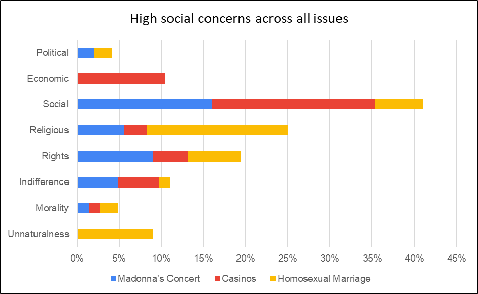
*Figure 1: High social concerns across all issues*

However, conservative opinions on homosexual marriages are still grounded in religious concerns. Figure 2 shows that in discussing the legalisation of homosexual marriage, not only is religion the main concern involved, but majority of religious invocations are used to defend the conservative position. This would also validate “Rights Versus Morality” by Detenber et al. which shows how religion is significant in the LGBTQ debate.

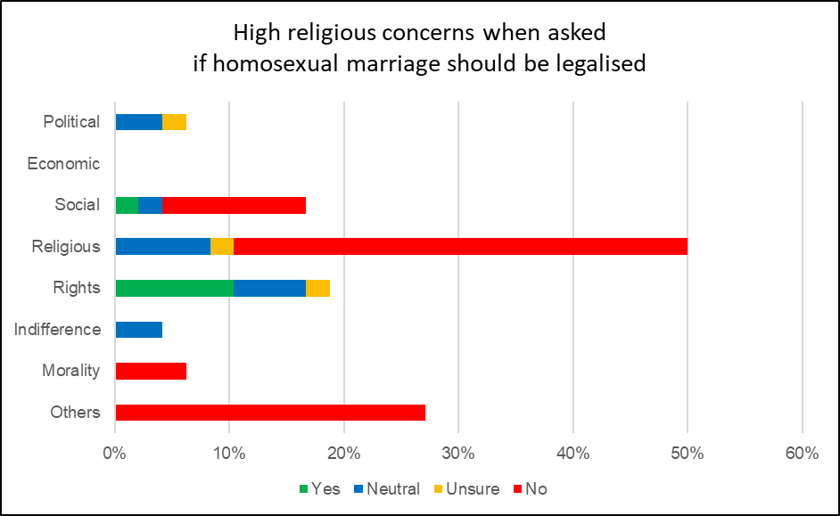
*Figure 2: High religious concerns when asked if homosexual marriage should be legalised*

It is important to note that while most respondents were against the legalisation of homosexual marriage, about 8% of respondents had religious concerns but were neutral (Figure 2). There were two approaches observed. The first involved respondents striking a balance between conservative religious influences and personal indifference or not imposing on others.

> *“God has said that it is wrong, but this does not personally concern me as I am heterosexual” (Protestants / Other Christians, 21 – 30 years old)*

> *“[I am] Conflicted between my Catholic beliefs and the urge for me to value other people who are not of the same faith” (Catholic, below 21 years old)*

The second approach had respondents arguing that the religious perspective necessitates neutrality since imposing one’s beliefs onto others disagrees with religious teachings.

> *“In this case, I don't think I should be voting at all. I'm a cisgender male, and that means my vote doesn't count […] I've no right to place my definition of marriage on someone else. That's not Christ-loving.”  (Protestants / Other Christians, 21 – 30 years old)*

Ultimately, less conservative positions also contribute to the high religious concerns surrounding homosexuality.

However, this high invocation of religious concerns is not seen in the other two issues. From the first two columns of Figure 3, religion is rarely a concern in the Madonna and casino issue. Even in the issue of Madonna’s concert where religiously insensitive content was likely to threaten Singapore’s religious harmony, only less than 20% of respondents were concerned about religious factors.

Yet, the last column shows that religion is invoked in the issue of homosexual marriage twice as often as the other two issues combined. This shows the stark difference in how often this issue involves religious concerns, especially since homosexuality is not outrightly insensitive towards Christianity like how some of Madonna’s songs were.

*Figure 3: Difference in proportions of religious concerns in homosexual marriage issue*

As a whole, data has shown that although current literature is divided over how Christians justify their positions, it does not mean that the literature is incorrect. In fact, although Christians tend to favour social concerns on issues such as the Madonna concert and casinos, religion is more frequently invoked in issues involving homosexual marriage. This raises the question “What is unique about homosexual marriage that leads to this?”.

## Explaining The Difference

This study suggests two characteristics of homosexuality issues that contribute to the difference in proportion. Firstly, there seems to be a lack of prominent social factors related to homosexuality, resulting in an imbalance of social concerns among the three issues. Figure 4 shows that while a substantial number of Christians consider social effects on the Madonna and casinos issues, only 16% of respondents did so for homosexual marriages, irrespective of the final position held.

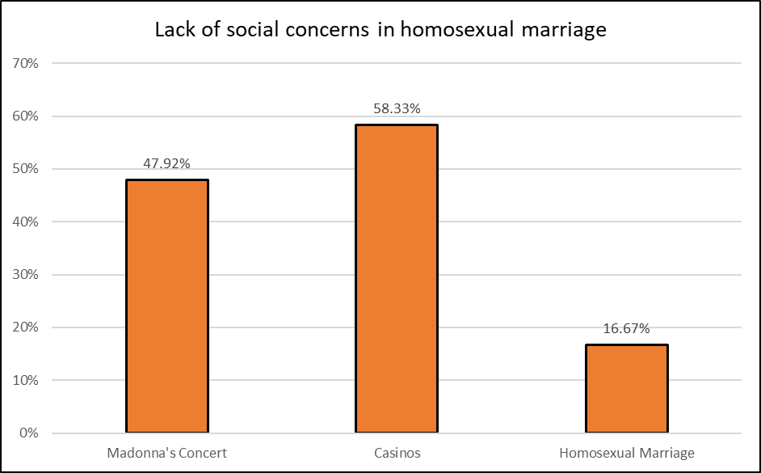
*Figure 4: Lack of social concerns in homosexual marriage*

Given that Singaporean Christians prioritise social concerns, social factors are the main criteria for issues to be judged on. However, Figure 4 suggests that the issue of homosexual marriage is somehow unable to invoke strong social concerns. This may be due to several reasons. For example, either homosexuality does not significantly influence society, or Singaporeans are unaware of possible social factors that accompany the legalisation of homosexual marriage. Regardless, this statistic suggests that the lack of prominent social factors stems from the nature of homosexuality as a topic.

Secondly, Christianity in Singapore is firmly conservative against homosexuality. This is especially since verses in the Bible have explicitly condemned homosexual acts (BibleGateway, 2020).

> *If a man lies with a male as with a woman, both of them have committed an abomination; they shall surely be put to death; their blood is upon them. (Leviticus 20:13)*

In addition, this also remains the official position of majority of churches in Singapore. The National Council of Churches of Singapore maintains that “the Bible clearly and categorically prohibits homosexual behaviour because it is a perversion of the way in which God has ordered human sexual relationships” (National Council of Churches of Singapore, 2018). The Roman Catholic Archdiocese of Singapore also does not condone homosexual behaviour (Goh, 2018). With strong and clear positions held by local churches and Christianity, it is hence natural that religion is a significant concern for Christians. Even if an individual disagrees with this conservative position, the strong position taken by Christianity seems to necessitate Christians to, at least, consider that religious factor.

Hence, this study suggests that it is the combination of the lack of prominent social concerns and Christianity’s strong and clear stance against homosexuality that led to the difference observed. In other words, since there are few social concerns to consider, religion naturally becomes a main concern to Christians. On both the issues of Madonna and casino, it is worthwhile to mention that local churches have also publicly voiced strong disagreements. However, it is precisely due to the presence of prominent social concerns in both issues that religion is not as strongly invoked. Likewise, without the strong and clear stance of Christianity, invocation of religion would not be as frequent in the issue of homosexual marriages.

## Discussion

The question that must be addressed is if such an explanation derived from a survey is warranted. However, people’s thought processes are complex, and a survey would not be able to sufficiently capture that information with clarity and depth. This is because personal subjectivity is involved in analysing and interpreting the data. For example, one response defending its position against the legalisation of homosexual marriage merely states:

> *“It is just not right.” (Protestant / Other Christians, 31 – 40 years old)*

In this study, this response has been classified as an “Unnatural” concern. However, others may argue that this would be more appropriately categorised as “Religious” or “Morality”. The lack of a follow up with respondents results in the inability to clarify the intended meaning behind such responses.

As such, further studies using fully qualitative methodologies can be done to verify if homosexuality indeed lacks prominent social concerns. Methods, such as interviews, allows the interviewee to further explain in detail their anxieties regarding the legalisation of gay marriage. Questions can also be asked to clarify if such anxieties are purely grounded in religion, or if there are in fact other social influences, albeit less significant. 

Additionally, further studies can involve a wider range of issues. With the limitations of this study, some respondents may have different responses due to the one-off nature of Madonna’s concert, compared to the long term institutional implications of casinos and homosexual marriages. Hence, other studies may also explore if such considerations may influence the results.

## Conclusion

This study argues that there is a difference in proportion of religious invocation in the issue of homosexual marriage compared to other issues despite there being a large emphasis on social and non-religious concerns. In explaining this phenomenon, this study proposes that this difference arises from the combination of two observations. Firstly, evidence shows that there appears to be a lack of prominent social concerns regarding homosexual marriages. Secondly, Christianity in Singapore holds a strong and clear stance against homosexuality. Together, these observations would explain the high religious concerns, regardless of position held.

---

## Bibliography

Abdullah, W. J. (2019). Electoral Secularism in Singapore: Political Responses to Homosexuality. Asian Studies Review, 43(2), 239-255. doi:10.1080/10357823.2019.1593945
BibleGateway. (2020). Leviticus 20:13. Retrieved from BibleGatewa: https://www.biblegateway.com/passage/?search=Leviticus+20%3A13&version=ESV
Chong, T. (2015). The church and the state in Singapore. In J. Lim, & T. Lee (Eds.), Singapore (1 ed., pp. 94-109). London: Routledge. doi:10.4324/9781315658599
Department of Statistics Singapore. (2015). Infographic - General Household Survey 2015. Retrieved from Department of Statistics Singapore: https://www.singstat.gov.sg/-/media/files/visualising_data/infographics/ghs/highlights-of-ghs2015.pdf
Detenber, B. H., Cenite, M., Zhou, S., Malik, S., & Neo, R. L. (2014). Rights Versus Morality: Online Debate About Decriminalization of Gay Sex in Singapore. Journal of Homosexuality, 61(9), 1313-1333. doi:10.1080/00918369.2014.926769
Goh, W. (18 September, 2018). Pastoral Letter on S377A to Catholics. Retrieved from Roman Catholic Archdiocese of Singapore: https://www.catholic.sg/pastoral-letter-archbishop-s377a/
Hadi, E. A. (23 February, 2016). Madonna not allowed to perform religiously sensitive songs such as Holy Water at her concert here. Retrieved from The Straits Times: https://www.straitstimes.com/lifestyle/entertainment/madonna-not-allowed-to-perform-religiously-sensitive-songs-such-as-holy
Han, S. (2018). Wear White: The mediatized politics of religious anti-LGBT activism in Singapore. Nordix Journal of Religion and Society, 31(1), 41-57. Retrieved from https://www.idunn.no/nordic_journal_of_religion_and_society/2018/01/wear_white_the_mediatized_politics_of_religious_anti-lgbt_?languageId=2
Koh, F. (2 March, 2020). The Straits Times. Retrieved from Parliament: Law protects both religious groups and LGBT community from threats, says Shanmugam: https://www.straitstimes.com/politics/parliament-law-protects-both-religious-groups-and-lgbt-community-from-threats-says
Kok, X. (1 July, 2017). Pink Dot rally draws thousands of people. Retrieved from The Straits Times: https://www.straitstimes.com/singapore/pink-dot-rally-draws-thousands-of-people
Lankford, J., & Moore, R. (16 January, 2018). The Real Meaning of the Separation of Church and State. Retrieved from TIME: https://time.com/5103677/church-state-separation-religious-freedom/
Lee, H. (18 April, 2005). Proposal To Develop Integrated Resorts. Retrieved from Ministry of Trade and Industry Singapore: https://www.mti.gov.sg/-/media/MTI/Legislation/Public-Consultations/2012/Additional-Information-on-the-Integrated-Resorts/ministerial-statement---pm-18apr05.pdf
Lee, H. (12 May, 2015). Transcript of Speech by Prime Minister Lee Hsien Loong at 66th Anniversary of Inter-Religious Organisation on 12th May 2015 at Istana. Retrieved from Prime Minister's Office Singapore: https://www.pmo.gov.sg/newsroom/transcript-speech-prime-minister-lee-hsien-loong-66th-anniversary-inter-religious
Lee, H. (23 September, 2019). Prime Minister's Office Singapore. Retrieved from Speech by PM Lee Hsien Loong at the Appeal of Conscience Foundation Annual Awards Dinner on 23 September 2019.: https://www.pmo.gov.sg/Newsroom/PM-Lee-at-the-Appeal-of-Conscience-Foundation-Dinner
Lee, P. (23 February, 2016). Archbishop speaks out against Madonna's concert. Retrieved from The Straits Times: https://www.straitstimes.com/singapore/archbishop-speaks-out-against-madonnas-concert
Masci, D., & Lipka, M. (21 December, 2015). Where Christian churches, other religions stand on gay marriage. Retrieved from Pew Research Center: https://www.pewresearch.org/fact-tank/2015/12/21/where-christian-churches-stand-on-gay-marriage/
Mathews, M. (January, 2009). Christianity in Singapore: The Voice of Moral Conscience to the State. Journal of Contemporary Religion, 24(1), 53-65. doi:10.1080/13537900802630505
Mathews, M., Lim, L., & Selvarajan, S. (May, 2019). Religion, Morality and Conservatism in Singapore. Singapore: Institute of Policy Studies. Retrieved from Relg: https://lkyspp.nus.edu.sg/docs/default-source/ips/ips-working-paper-34---religion-morality-and-conservatism-in-singapore.pdf
Mathews, M., Tay, M., & Selvarajan, S. (2019). Faultlines in Singapore: Public Opinion on their Realities, Management and Consequences. Singapore: IPS Working Papers. Retrieved from https://lkyspp.nus.edu.sg/news-events/news/details/ips-working-paper-no.-37-faultlines-in-singapore-public-opinion-on-their-realities-management-consequences
Mokhtar, F. (18 September, 2018). The Straits Times. Retrieved from The Big Read: With a house still divided over 377A, time to seek common ground: https://www.channelnewsasia.com/news/singapore/377a-lgbt-singapore-same-sex-penal-code-review-10727610
National Council of Churches of Singapore. (4 December, 2010). Casinos. Retrieved from National Council of Churches of Singapore: https://nccs.org.sg/2010/12/casinos/
National Council of Churches of Singapore. (13 September, 2018). National Council of Churches of Singapore. Retrieved from National Council of Churches’ Position Remains Unchanged: RETAIN 377A: https://nccs.org.sg/wp-content/uploads/2018/09/NCCS-Statement-Retain-377A.pdf
Pew Research Center. (4 April, 2014). Pew Research Centre. Retrieved from Global Religious Diversity: https://www.pewforum.org/2014/04/04/global-religious-diversity/
Public Service Division. (2015). Cultivating A Harmonious Society, Becoming One People. Retrieved from Public Service Division: https://www.psd.gov.sg/heartofpublicservice/our-institutions/cultivating-a-harmonious-society-becoming-one-people/
Shanmugam, K. (7 October, 2019). Second Reading Speech for the Maintenance of Religious Harmony (Amendment) Bill - Speech by Mr K Shanmugam, Minister for Home Affairs and Minister for Law. Retrieved from Ministry of Home Affairs: https://www.mha.gov.sg/newsroom/in-parliament/parliamentary-speeches/news/second-reading-speech-for-the-maintenance-of-religious-harmony-amendment-bill-speech-by-mr-k-shanmugam-minister-for-home-affairs-and-minister-for-law
Sin, Y. (23 October, 2020). Catholic stance on marriage remains unchanged, says S'pore Catholic Church in response to Pope Francis' remarks. Retrieved from The Straits Times: https://www.straitstimes.com/singapore/catholic-stance-on-marriage-remains-unchanged-says-spore-catholic-church-in-response-to
Singapore Statutes Online. (10 September, 2020). Singapore Statutes Online. Retrieved from Penal Code: https://sso.agc.gov.sg/Act/PC1871?ProvIds=pr377A-
Tan, E. K. (2008). Keeping God in Place: The Management of Religion in Singapore. In A. Lai (Ed.), Religious Diversity in Singapore (pp. 55-82). Singapore: Institute of Southeast Asian Studies and Institute of Policy Studies, National University of Singapore. Retrieved from http://worldcat.org/isbn/9789812307545
Vogue, A. d., & Diamond, J. (27 June, 2015). Supreme Court rules in favor of same-sex marriage nationwide. Retrieved from CNN: https://edition.cnn.com/2015/06/26/politics/supreme-court-same-sex-marriage-ruling/
Wong, S. (5 June, 2015). Singapore not ready for same-sex marriage as society is still conservative: PM Lee. Retrieved from The Straits Times: https://www.straitstimes.com/singapore/singapore-not-ready-for-same-sex-marriage-as-society-is-still-conservative-pm-lee
Yahya, Y. (8 September, 2018). The Straits Times. Retrieved from Tommy Koh's Facebook comment reignites debate on Singapore's gay sex law: https://www.straitstimes.com/politics/tommy-kohs-facebook-post-on-gay-sex-law-reignites-debate-on-singapores-penal-code

---

## Appendix A

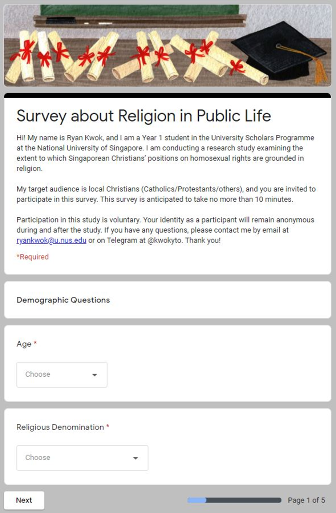
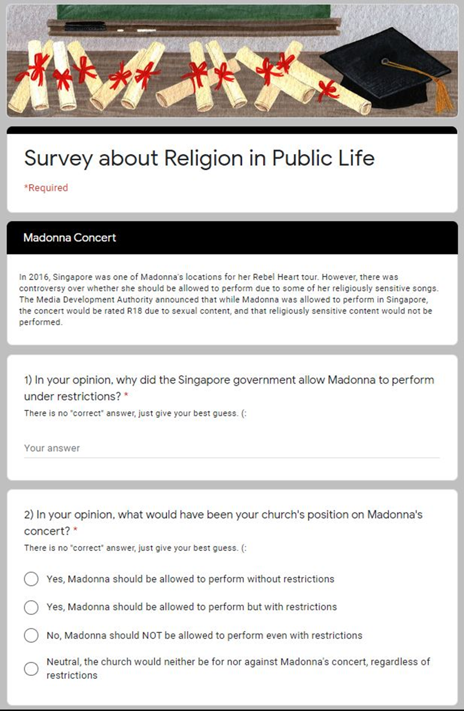
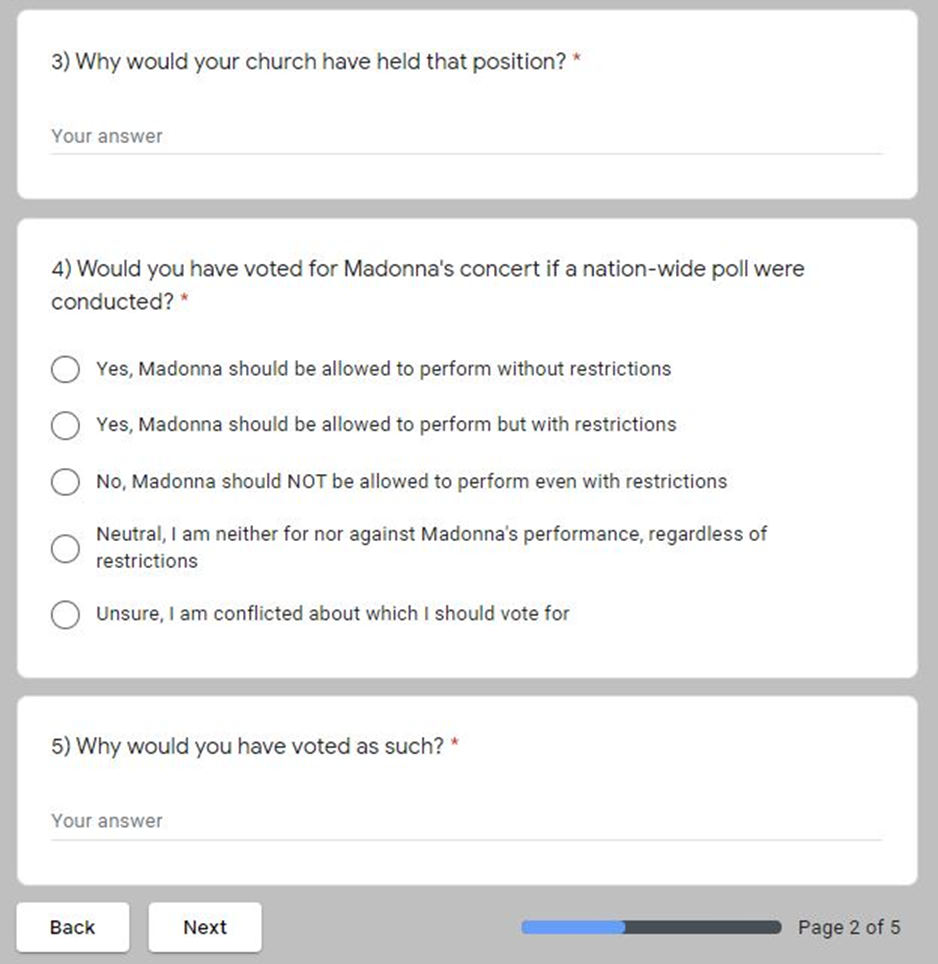
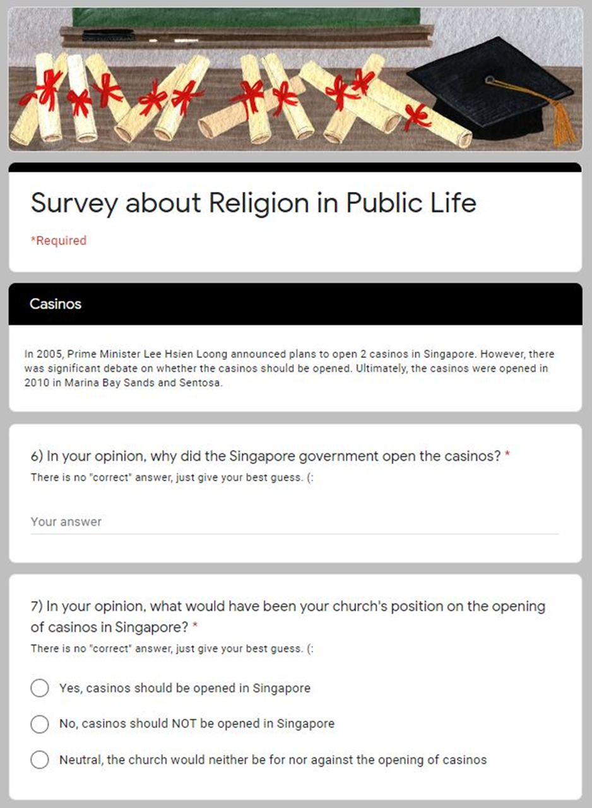
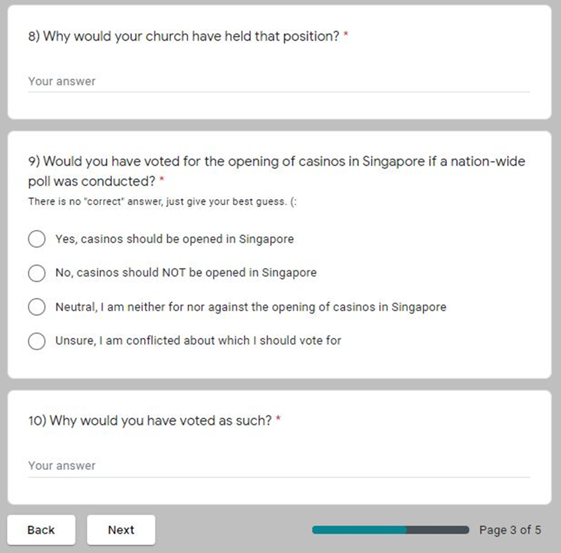
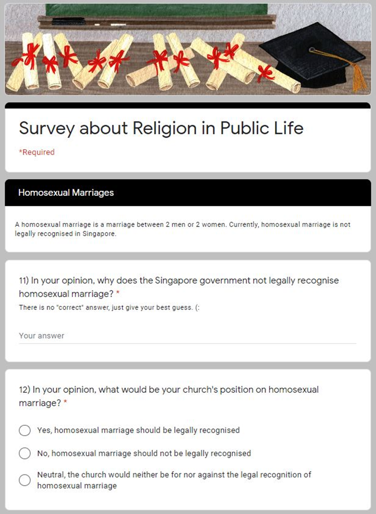
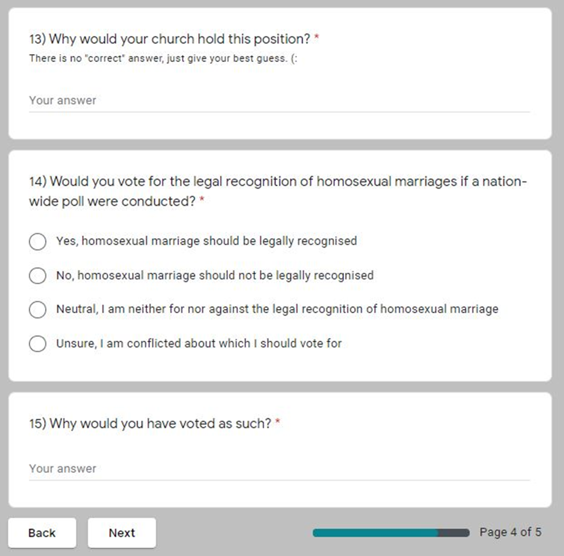
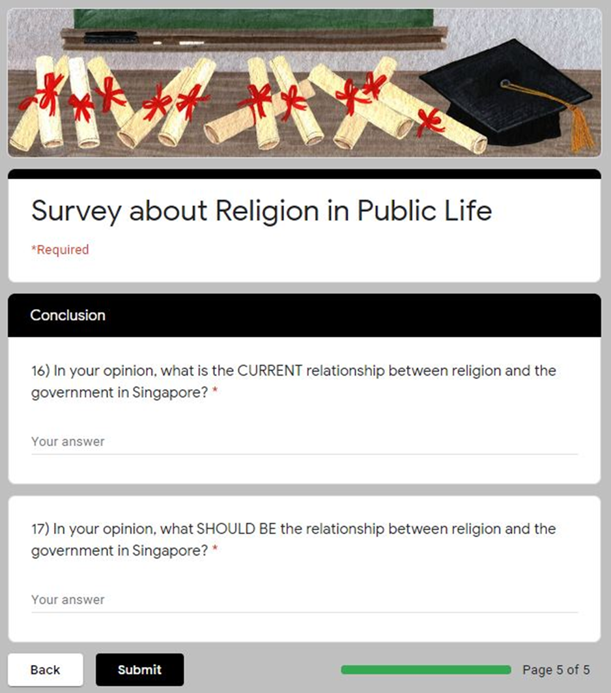

---

## Appendix B

The responses are coded into 8 categories, namely: Political, Economic, Social, Religious, Indifference, Morality, and Unnaturalness. Below is an explanation of each category, along with examples. In addition, a few examples of responses with mixed concerns (and hence assigned into multiple categories) would be given.

### Political Concerns

Political concerns generally mention a state decision to appease local communities, maintain an organizational image, or maintain secularism in Singapore. Regarding the state’s response to the Madonna issue:

> *“They did not want to offend either one of the Christian/LGBTQ communities” (Protestants / Other Christians, 21 – 30 years old)*

> *“[Government] prefers to be more inclusive and be seen as 'open'” (Protestants / Other Christians, 50 – 59 years old)*

> *“I think it is with the consideration that the government hopes to remain secular and therefore non-discriminative to any specific religion.” (Protestants / Other Christians, below 21 years old)*

### Economic Concerns

Economic concerns invoke the added revenue and business for Singapore. Regarding the state’s response to the Madonna issue:

> *“It is so that profits can be made and that will increase total revenue” (Protestants / Other Christians, below 21 years old)*

Regarding the state’s response to the casino issue:

> *“I think the government did so to attract more tourists--- boost economic benefits for our country.” (Protestants / Other Christians, below 21 years old)*

### Social Concerns

Social concerns involve concern for families and the Singapore society, while also focusing on the religious peace and harmony that Singapore enjoys. Regarding the respondent’s position on the Madonna issue:

> *“I believe that this will give the younger generation a false impression on how religion is viewed and this might cause social unrest between different religions, which is undesirable” (Protestants / Other Christians, below 21 years old)*

Regarding the church’s position on the casino issue:

> *“It would have promoted gambling habits and that is bad for Singapore. Gambling addicts will borrow money to gamble and cause misery to their families.” (Protestants / Other Christians, 50 – 59 years old)*

Regarding the respondent’s position on the homosexual marriage issue:

> *“Destroys family units.  Does not add to falling birth rate.” (Protestants / Other Christians, 50 – 59 years old)*

### Religious Concerns

Religious concerns invoke God or the Bible. Regarding the church’s position on the issue of homosexual marriage:

> *“God created Adam and Eve, man and women, to be together and create a community of godly children. He didn’t plan for people of the same sex to marry, hence homosexual marriage will also be restricted by the church” (Protestants / Other Christians, below 21 years old)*

> *“It is against the teaching in the Bible. Bible clearly warns against homosexuality” (Protestants / Other Christians, 50 – 59 years old)*

In addition, there were also religious invocations to how Christians should not judge and impose, but that only God can judge. Regarding the church’s position on the Madonna issue:

> *“We are not in a position to judge others for their beliefs; only God can judge” (Protestants / Other Christians, 21 – 30 years old)*

Regarding the respondent’s position on the homosexual marriage issue:

> *“[…] I've no right to place my definition of marriage on someone else. That's not Christ-loving.” (Protestants / Other Christians, 21 – 30 years old)*

### Indifference Concerns

Indifference involved respondents who are not involved in the issue, and hence would not hold a strong opinion towards any opinion. Regarding the respondent’s position on the Madonna issue:

> *“I’m not a fan of hers.” (Catholic, 41 – 50 years old)*

> *“doesn't make a difference to me” (Catholic, 21 – 30 years old)*

### Morality Concerns

Responses classified under “Morality” have direct claims to what is moral or not. Regarding the respondent’s position on the casino issue:

> *“[…], instead I see that it corrupts the Singaporean moral values” (Protestants / Other Christians, 21 – 30 years old)*

### Unnaturalness Concerns

This category is a unique category that only exists for the issue of homosexual marriages. This contains responses than mention unnaturalness, or non-conformity to the traditional definition of marriage. For example:

> *“homosexuals go against nature” (Catholic, below 21 years old)*

> *“It is the natural order of life. One that only a man and a woman can play their unique role and fulfil their parental responsibilities in a marriage” (Protestants / Other Christians, 41 – 50 years old)*

> *“Two persons of the same gender can be very good friend and partners for life, but having a sexual relationship is not obviously possible.  Therefore, they can be respected as best friends that share a lot in common, but they do not need to engage in sexual relation, and hence do not need this special recognition as marriage couples and children require.” (Catholic, 50 – 59 years old)*

### Mixed Responses

Some responses are fairly complex and invoked multiple concerns. These responses would be categorised under all of the concerns involved. For example, regarding the state’s response to the Madonna issue, this response was categorised under “Economic”, “Social”, and “Rights”.

> *“To safeguard religious harmony here, censorship of risqué content is necessary while at the same time, not restricting artistic showmanship. If every controversial performer were to be slapped with a blanket censor here and there, tourism will take a hit. And that’s detrimental to our country.” (Catholic, 41 – 50 years old)*

> *Regarding the respondent’s position on the casino issue, this response was categorised under “Economic”, “Social”, and “Religious”.*

> *“I think I'm weighing both my religion as well as the economic endeavours of my country at hand. And I don't think they're mutually exclusive in this case. Gambling in itself can pose a low risk to society if regulated well. As for religion, I know for certain that the moral systems I've been taught aren't ends in themselves, but rather means to some end of making better human beings and societies. If I can be convinced that the casinos will be regulated enough that Families won't be affected, I'll be willing to make a balanced "yes" to the idea of opening them.” (Protestants / Other Christians, 21 – 30 years old)*

[< Back to University Essays and Work](/uni_work/uni_work.md)
